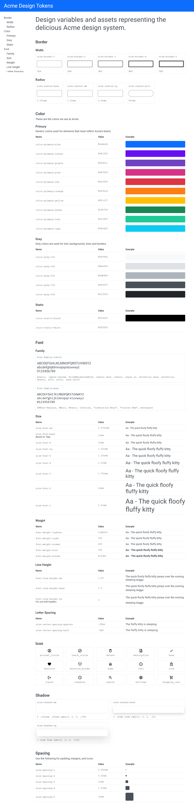

# Single-page Static Style Guide Using EJS Templates

Single-page style guide, using the [EJS templating language](https://ejs.co), and generated with a custom Style Dictionary [format](https://amzn.github.io/style-dictionary/#/formats).

_Note, the generated style guide is not super pretty; I'm not a designer._

<details><summary>Screenshot</summary></details>

## Files

The following are standard for a Style Dictionary project:

- `assets/` - Fonts and icons.
- `dist/` - Target folder for generated design tokens and assets.
- `src/` - The bare minimum transforms and formats necessary to generate this example.
- `tokens/`
- `sd.config.js` - Style Dictionary configuration.

The following are specific for generating the static style guide:

- `public/` - Where the style guide is built. Copy the contents of this folder to a publicly accessible location, like GitHub Pages.
- `src/styleGuide.js` - Style Dictionary formatter, which generates `index.html`.
- `views/` - EJS templates for `index.html`, as well as formatting for token names, values and samples.
- `style-guide-config.json` - Represents the metadata and structure of the style guide. Tokens are organized into sections and subgroups, and each group can have a different presentation.

## How It Works

The [`style-guide/static`](src/styleGuide.js) custom format imports [`style-guide-config.json`](style-guide-config.json), merges the associated tokens into each group, and generates `public/index.html`.

The following is an annotated version of `style-guide-config.json`. It defines the structure of the style guide, as well as how to render each design token.

```jsonc
{
  "title": "page title",
  "introduction": "optional intro paragraph",
  "sections": [
    {
      "title": "section title, e.g. Colors",
      "groups": [
        {
          "title": "optional group title, e.g. Primary Colors",
          "tokensPath": "tokens path, e.g. color.primary",
          "order": [
            // optional override for token order,
            // based on token name
            // e.g. ["red-1", "red-base", "red-3"]
          ],
          // Supported layouts: "table", "grid", "grid-[1-5]"
          "layout": "table",
          // EJS template (without file extension) to render
          // the token's name. Defaults to "default".
          "nameFormat": "see views/name/",
          // EJS template (without file extension) to render
          // the token's value. Default depends on layout.
          "valueFormat": "see views/value/",
          // EJS template (without file extension) to render
          // a sample/example of the design token.
          "sampleFormat": "see views/value/"
        }
      ]
    }
  ]
}
```

## Commands

- `npm run build`
  - Runs the Style Dictionary "build" command.
- `npm run clean`
  - Runs the Style Dictionary "clean" command which will remove all files created by the last Style Dictionary build.
- `npm start`
  - Generates a build, then starts watching source files for changes. If any files change, Style Dictionary runs the build again.
- To see your work, open `public/index.html` in your favorite browser.
