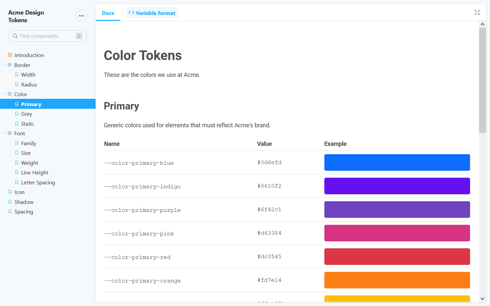

# Style Guide Using Storybook

Style guide generated with React and [Storybook](https://storybook.js.org/).

Also includes a toolbar addon to change the format of the design token's name (e.g. "`--a-css-var`", "`$a-sass-var`", "`aJsVar`").

Hot Tip: If you are running Storybook >= 6.4, check out the [Storybook Composition](https://storybook.js.org/docs/react/sharing/storybook-composition) feature, which lets you embed a Storybook within another Storybook.

<details><summary>Screenshot</summary></details>

## Files

The following are standard for a Style Dictionary project:

- `assets/` - Fonts and icons.
- `dist/` - Target folder for generated design tokens and assets.
- `src/style-dictionary/` - The bare minimum transforms and formats necessary to generate this example.
- `tokens/`
- `sd.config.js` - Style Dictionary configuration.

The following are standard for a Storybook project:

- `.storybook/` - Storybook configuration.
  - Change the Storybook title in `manager.js`.
- `src/` - React components and related utilities.

The following are specific for generating the style guide:

- `src/components/` - React components for rendering design token groups and individual design tokens.
- `src/tokens-context.js`
- `src/utils.js`
- `style-guide/` - MDX-flavored Storybook pages.

## How It Works

Using the [`json`](https://amzn.github.io/style-dictionary/#/formats?id=json) formatter, Style Dictionary generates `dist/tokens.json`, which contains a dump of every (fully transformed) design token.

Each Storybook [page](style-guide/) imports `dist/tokens.json`, which is then filtered (using [`getTokenGroup()`](src/utils.js)) to display a group of related design tokens.

## `tokenVariableFormat` Toolbar Addon

This toolbar addon changes how each design token name is formatted.

```
raw:  token-name
css:  --token-name
scss: $token-name
js:   tokenName
```

- The addon is registered in [`.storybook/preview.js`](.storybook/preview.js).
  - See `globalTypes.tokenVariableForm` for configuration, such as defining which formats can be selected.
- A global decorator (see `.storybook/preview.js`) injects the selected format into a [React Context](https://reactjs.org/docs/context.html), which makes it available to each Storybook story.

## Commands

- `npm run styledictionary`
  - Generates a Style Dictionary build, then starts watching source files for changes. If any files change, Style Dictionary runs the build again.
- `npm run build-styledictionary`
  - Runs the Style Dictionary "build" command.
- `npm run clean-styledictionary`
  - Runs the Style Dictionary "clean" command which will remove all files created by the last Style Dictionary build.
- `npm run storybook`
  - Starts a local version of Storybook, and watches for source file changes.
- `npm run build-storybook`
  - Generates a static build of Storybook.
